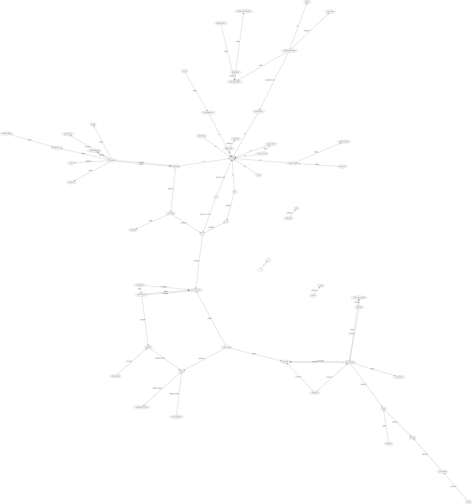
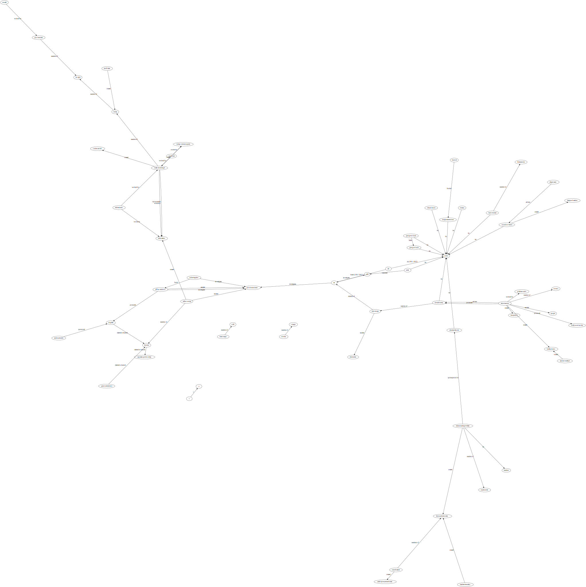
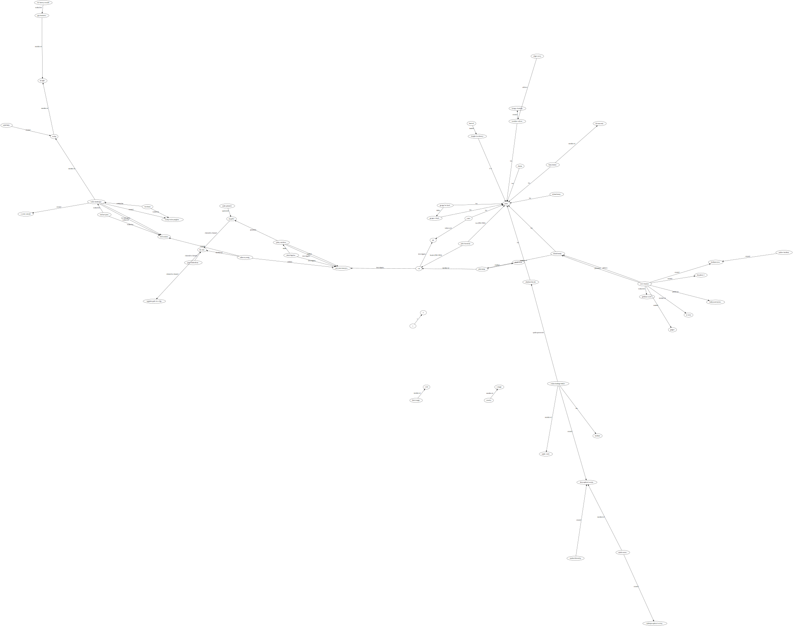

# Testing Prisma

## Synopsis

    npm run db:start       # Start pg in a Docker container
    npm run db:stop

    npm run anew           # Build scheme, populate db, create ERD, test
    npm test               # Run all tests
    npm run test:unit      # Run unit tests without the database
    npm run test:int       # Run integration tests upon the db and Prisma

## Scheme

A simplistic star scheme that centers on actions, used to describe who did what to whom, when it happened, with citations,
where the 'who' is an `Entity` (either a person or organisation).

## About the environment

Tests need to look after the environment, to leave things as they were found. Whilst this is always a good habit to maintain,
it can ben an effort that quickly becomes a chore, and so frequently gets discarded, leading to a build up of unused cruft
in the database that is never in a known state, leading to false positive test failures, leading to time spent debugging
tests rather than writing logic.

Thus the test suite aims to make keeping the environment clean as easy as possible, by mocking where possible and practicle,
and using known-state environment fixetures.

## Writiing integration tests

Tests which touch any real system, other than the unit under test, are considered integration tests, and
are suffixed `.int.spec.ts`.

    /**
    * @jest-environment ./test/lib/prisma-test-env.ts
    */

Don't bother with the above "Jest custom environment" docblock, it is both non-blocking and slow, so fails to
complete execution before it can configure the connection string used in the tests.

Instead, call the custom environment manually, so it can set beforeEach and afterEach hooks to clean the environment.

    import PrismaTestEnvironment from "testlib/prisma-test-env";

    PrismaTestEnvironment.init();

Because use of a long-running global transaction apparently not supported by Prisma, the above creates a PG DB schema per test,
which it destroys after the test.

## Writing Unit Tests

See examples.

## TODO

- Deeper mock RVs
- Playwrite
- Percy

## NOTES

## Links

    https://towardsdatascience.com/tricks-for-postgres-and-docker-that-will-make-your-life-easier-fc7bfcba5082
    https://github.com/prisma/prisma/discussions/2083
    https://github.com/prisma/prisma/discussions/2083
    https://github.com/prisma/prisma-examples/tree/latest/typescript/testing-express
    https://www.prisma.io/docs/guides/testing/unit-testing
    https://www.youtube.com/watch?v=E-FHalzAOFs

# Proposed Ingestion Format

Should be easy for non-techies to edit by hand.

## Entity (DoB-DoD)

### `perlre` definition:

    /^ \w* ([^\(]+) \w+ \( (\d{4}–\d{2}–\d{2]) \w*-\w* (\d{4}–\d{2}–\d{2]) \w* ) $/

### Examples:

    Andre Puharich (1918-02-19 – 1995-01-03)
    heosophical Society
    Anthroposophical Society

## Entity-Verb-Entity

### `perlre` definition:

    /^ \w*
      \[                    # Surrounded by square brackets,
        ([^\]]+)            # $1 Subject
      \]                    # End square bracket surrounding subject
       \w* --\> \w*         # --> arrow, maybe surrounded by whitespace
      \|                    # Surrounded by bars
         ( [^\|]+ )         # $2 Verb
      \|                    # nd bars surrounding verb
      \w*                   # May be whitespace
      \[                    # Surrounded by square brackets
        ( [^\]]+ )          # $3 Object
      \]                    # End square brackets surrounding object
      \w*                   # May be whitespace
      # (.+)?               # $4 Comment
      \w*                   # May be whitespace at the end of the line
    $/x

### Aparigraha Examples:

    [Andre Puharich]        -->  ||sponsored|           [Uri Geller]
    [Arthur Young]          -->  ||member-of|           [The Nine]
    [Arthur Young]          -->  ||created|             [Bell Aviation]
    [Arthur Young]          -->  |studied|              [psi-consciousness]
    [Gene Roddenberry]      -->  |claiemd to channel|   [The Nine]
    [Uri Geller]            -->  |claiemd to channel|   [The Nine]
    [Jeffrey Mishlove]      -->  |studied|              [psi-consciousness]
    [The Nine]              -->  ||claimed to channel|  [Egyptian Gods in a ship]
    [Jeffrey Mishlove]      -->  |promoted|             [Uri Geller]
    [Harry Truman]          -->  |isa|                  [Mason]
    [Harry Truman]          -->  |isa|                  [POTUS]
    [JFK]                   -->  |isa|                  [POTUS]
    [Richard Nixon]         -->  |isa|                  [POTUS]
    [Donald Trump]          -->  |isa|                  [POTUS]
    [George HW Bush]        -->  |isa|                  [POTUS]
    [George W Bush]         -->  |isa|                  [POTUS]
    [Obama]                 -->  |isa|                  [POTUS]
    [Carter]                -->  |isa|                  [POTUS]
    [Carter]                -->  |witnessed|            [UFO]
    [CIA]                   -->  |investigates|         [UFO]
    [CIA]                   -->  |investigates|         [psi-consciousness]
    [Robert Bigelow]        -->  |investigates|         [psi-consciousness]
    [Robert Bigelow]        -->  |investigates|         [psi-consciousness]
    [Robert Bigelow]        -->  |funds|                [Jeffrey Mishlove]
    [Jeffrey Mishlove]      -->  |investigates|         [psi-consciousness]
    [Woodrow Wilson]        -->  |isa|                  [POTUS]
    [Edgar Casey]           -->  |advises|              [Woodrow Wilson]       # Leauge of Nations
    [Woodrow Wilson]        -->  |created|              [Leauge of Nations]
    [Rudolf Steiner]        -->  |created|              [Anthroposophical Society]
    [Madam Blavatsky]       -->  |created|              [Theosophical Society]
    [Rudolf Steiner]        -->  |memberr of|           [Theosophical Society]
    [Steve Bannon]          -->  |studied|              [Gurgev]
    [Steve Bannon]          -->  |promoted|             [Donald Trump]
    [Steve Bannon]          -->  |member of|            [US Navy]
    [Steve Bannon]          -->  |created|              [Biosphere 2]
    [Steve Bannon]          -->  |worked for|           [Goldman Sachs]
    [Steve Bannon]          -->  |created|              [Breitbart News]
    [Steve Bannon]          -->  |produced|             [Hollywood Movies]
    [Andrew Breitbart]      -->  |created|              [Breitbart News]
    [Steve Bannon]          -->  |advises|              [Donald Trump]
    [Donald Trump]          -->  |nephew of|            [John Trump]
    [John Trump]            -->  |member of|            [CIA]
    [John Trump]            -->  |studied|              [Nikola Tesla]
    [Emma Hardinge-Britten] --> |created|               [Theosophical Society]
    [Emma Hardinge-Britten] --> |spokesperson for|      [Abraham Lincoln]
    [Emma Hardinge-Britten] --> |member of|             [Orphic Circle]
    [Emma Hardinge-Britten] --> |isa|                   [Medium]
    [Abraham Lincoln]       --> |isa|                   [POTUS]
    [Black Magic]           --> |member of|             [X Left]
    [Crowley]               --> |member of|             [X Magic]
    [Michael Pane]          --> |worked at|             [Bell Aviation]
    [Michael Pane]          --> |worked for|            [Walter Dornberger]
    [Walter Dornberger]     --> |worked at|             [Bell Aviation]
    [Walter Dornberger]     --> |vice-president|        [Bell Aviation]
    [Walter Dornberger]     --> |member of|             [NSDAP]
    [Walter Dornberger]     --> |created|               [NSDAP rocket program]
    [Walter Dornberger]     --> |created|               [X series aircraft]
    [Van Braun]             --> |worked at|             [NSDAP rocket program]
    [Van Braun]             --> |worked for|            [Walter Dornberger]
    [Adolf Hitler]          --> |created|               [NSDAP]
    [Dwight Eisenhower]     --> |is a|                  [POTUS]
    [Hunt Oil]              --> |funded|                [Dwight Eisenhower]
    [Oswald]                --> |worked for|            [Guy Bannister]
    [Guy Bannister]         --> |member a|              [far right]
    [NSDAP]                 --> |member a|              [far right]

Consider PROLOG.

## DOT

## FDP

## CIRCO

## TWOPI

