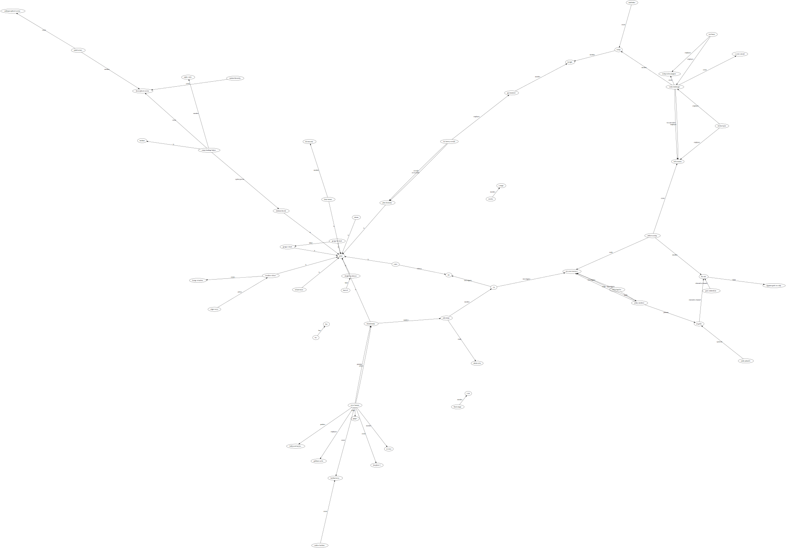

# Testing Prisma

## Synopsis

    npm start               # Start pg in a Docker container
    npm restart             # aka `npm run anew` - Build scheme, populate db, create ERD
    npm stop
    npm test               # Run all tests

    npm run test:unit      # Run unit tests without the database
    npm run test:int       # Run integration tests upon the db and Prisma
    npm run test:debug --  # following with match pattern
    npm run coverage

## Scheme

A simplistic star scheme that centers on predicates, used to describe who did what to whom, when it happened, with citations, where the 'who' is an `Entity` (either a person or organisation).

Both predicates and entities have date ranges.

## About the environment

Tests need to look after the environment, to leave things as they were found. Whilst this is always a good habit to maintain, it can ben an effort that quickly becomes a chore, and so frequently gets discarded, leading to a build up of unused cruft in the database that is never in a known state, leading to false positive test failures, leading to time spent debugging tests rather than writing logic.

Thus the test suite aims to make keeping the environment clean as easy as possible, by mocking where possible and practicle, and using known-state environment fixetures.

## Writiing integration tests

Tests which touch any real system, other than the unit under test, are considered integration tests, and are suffixed `.int.spec.ts`.

    /**
    * @jest-environment ./test/lib/prisma-test-env.ts
    */

Don't bother with the above "Jest custom environment" docblock, it is both non-blocking and slow, so fails to complete execution before it can configure the connection string used in the tests.

Instead, call the custom environment manually, so it can set beforeEach and afterEach hooks to clean the environment.

    import PrismaTestEnvironment from "testlib/prisma-test-env";

    PrismaTestEnvironment.init();

Because use of a long-running global transpredicate apparently not supported by Prisma, the above creates a PG DB schema per test, which it destroys after the test.

## Writing Unit Tests

See examples.

## Logging

Logging is via `pino`. `LOG_LEVEL` environment variable takes a lower-case log level (eg `debug`).

## Queries

Verb search is easiest via stems, provided through an insert/update trigger on `Verb.name` that populates `Verb.stem` the Postgres Snowball lexeme string. (It could contain multiple values, but it's a good enough for now.)

## TODO

- Kohenen projection!
- Link an `aka` table to Postgres Thesaurus configuration (Entity.id references Aka.id)
- GUI to gather timestamps:
  - embeds YouTube player
  - usual YT controls + pausing populates the citaiton field with a YT watch/$id?t=n link
  - Entity/verb predictive search (also via Kohenen projection)
    - stem-field for all words in the DB?
    - stem queries on receipt
    - is there a Node port of Snowball?
  - (Playwrite, Percy)
- Given tiemstamps, map the episode!
- Seed with the CSV?
- Prolog export

## NOTES

### Links

    https://towardsdatascience.com/tricks-for-postgres-and-docker-that-will-make-your-life-easier-fc7bfcba5082
    https://github.com/prisma/prisma/discussions/2083
    https://github.com/prisma/prisma/discussions/2083
    https://github.com/prisma/prisma-examples/tree/latest/typescript/testing-express
    https://www.prisma.io/docs/guides/testing/unit-testing
    https://www.youtube.com/watch?v=E-FHalzAOFs

## Proposed Ingestion Format

### Entities

CSV, with columns headered:

    Subject, Verb, Object, Comment

Consider PROLOG.

## ERD

## SVGs output from db seed

### DOT

## FDP

## CIRCO

## TWOPI

