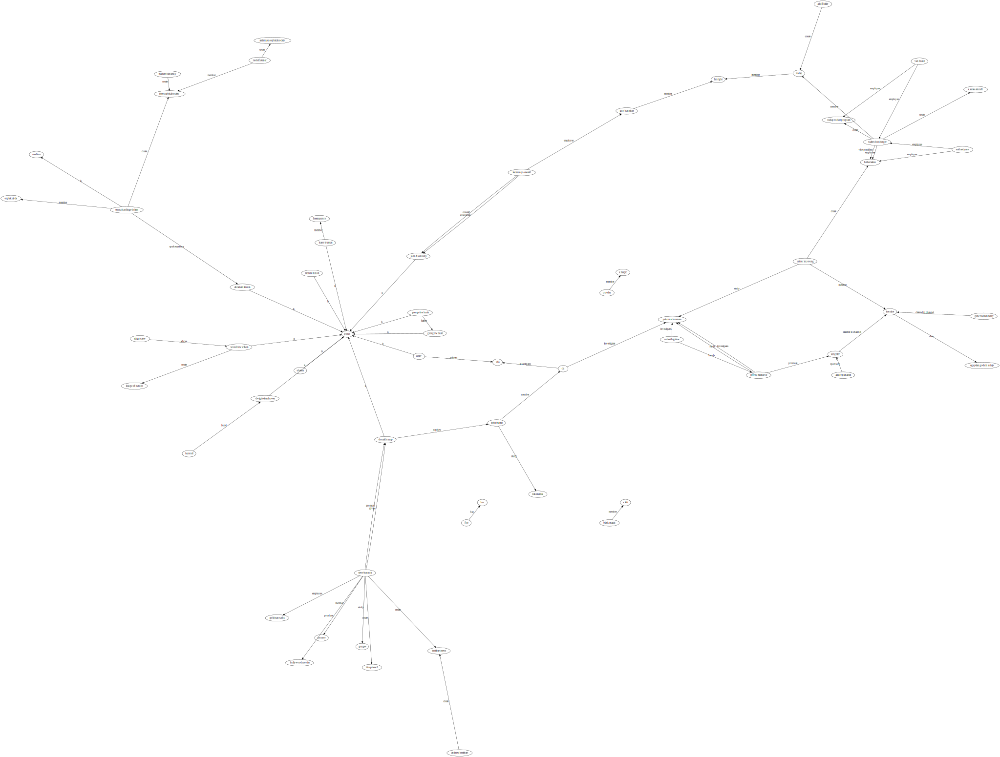

# Testing Prisma: Predicate Visualisation Through Entity-relations Diagrams

WIP

Testing Prisma: a small app to create ERDs via Graphviz from CSVs or through fastify/webcomponents gathering user-input against a YouTube video, to help visualise information presented in videos.

## Synopsis

    npm db:start           # Start PG in a Docker container
    npm run db:stop
    npm run anew           # Build scheme, populate DB, create ERD

    npm run wc:start       # Tiny HTTP server for the static web components demo
    npm run api:start      # Fastify api http server
    npm run api:dev        # "" in watch mode
    npm run dev            # Concurrently run wc:start and api:start

    npm test               # Run all tests
    npm run test:unit      # Run unit tests without the database
    npm run test:int       # Run integration tests upon the DB and Prisma
    npm run test:e2e       # Run Playwright tests
    npm run test:debug --  # ...followed by a Jest match pattern
    npm run coverage

## Dependencies

- Prisma
- Docker (just for Postgres)
- Graphviz
- Typescript
- Pino
- Jest
- Playwright

## Installation

Make sure Docker is running - tested with Docker Desktop 4.3.1.

npm install
npm run db:start
npm run anew
npm test

## DB Scheme

A simplistic star scheme that centers on logical predicates, used to describe who did what to whom, when it happened, with citations, where the 'who' is an `Entity` (either a person or organisation).

Both predicates and entities have date optional ranges (`start`/`end` and `dob`/`dod`, respectively).

## ERD

## About the environment

Tests need to look after the environment, to leave things as they were found. Whilst this is always a good habit to maintain, it can ben an effort that quickly becomes a chore, and so frequently gets discarded, leading to a build up of unused cruft in the database that is never in a known state, leading to false positive test failures, leading to time spent debugging tests rather than writing logic.

Thus the test suite aims to make keeping the environment clean as easy as possible, by mocking where possible and practicle, and using known-state environment fixetures.

## Writiing integration tests

Tests which touch any real system, other than the unit under test, are considered integration tests, and are suffixed `.int.spec.ts`.

    /**
    * @jest-environment ./test/lib/prisma-test-env.ts
    */

Don't bother with the above "Jest custom environment" docblock, it is both non-blocking and slow, so fails to complete execution before it can configure the connection string used in the tests.

Instead, call the custom environment manually, so it can set beforeEach and afterEach hooks to clean the environment.

    import PrismaTestEnvironment from "testlib/prisma-test-env";

    # To setup a DB for every test:
    PrismaTestEnvironment.setup({ingest: false});

    # Or just one for this file:
    let testEnvInstance: PrismaTestEnvironment;
    beforeAll(async () => testEnvInstance = await PrismaTestEnvironment.setupOnce({ ingest: false }));
    afterAll(() => PrismaTestEnvironment.teardown(testEnvInstance));

Because use of long-running global transactions are apparently not supported by Prisma, the above creates a PG DB schema per test, which it destroys after the test.

## Writing Unit Tests

See examples.

## Logging

Logging is via `pino`. `LOG_LEVEL` environment variable takes a lower-case log level (eg `debug`).

## TODO

- Move to external OpenAPI scheme to share between routes and superagent tests
- Populate built-in synonym table via verbs reduced to toponyms via wordnet
  - Link an `aka` table to Postgres Thesaurus configuration (Entity.id references Aka.id) and synonym table?
- Middleware to
  - cast dates to strings?
  - remove empty fields (since usage dictates no blanking of extant fields, only replacement)
- Kohenen projection!
- Given tiemstamps, map the episode!
- [Github Actions with custom docker](https://stackoverflow.com/questions/64033686/how-can-i-use-private-docker-image-in-github-actions)
- Prolog export

### GUI

- Enter YT URI
  - update video src
- Video
  - pause = record the timestamp for adding to Citations
  - Enter Subject.knownas / Verb / Object.knownas, each with autosuggestion:
    - send $q and $type (Entity/Verb),
    - stem $q
    - return top n matches in $type table where knownas_stem or formalname_stem partial matches, or the verb.stem matches stemmed $q
    - Maybe display editable Entity and Verb details?
- Submit
  - URL including timestamp
  - Subject / Verb / Object text
- (Playwrite, Percy)

## NOTES

### Links

    https://towardsdatascience.com/tricks-for-postgres-and-docker-that-will-make-your-life-easier-fc7bfcba5082
    https://github.com/prisma/prisma/discussions/2083
    https://github.com/prisma/prisma/discussions/2083
    https://github.com/prisma/prisma-examples/tree/latest/typescript/testing-express
    https://www.prisma.io/docs/guides/testing/unit-testing
    https://www.youtube.com/watch?v=E-FHalzAOFs

    https://css-tricks.com/svg-map-rollovers/
    https://meowni.ca/posts/part-theme-explainer/
    https://youtu.be/FlAFg9a2MSs?list=PLzou3TXfEb6brhE3llF3h7j6slBPfS3Hq&t=990

## Ingestion Format

### Entities

CSV, with columns headered:

    Subject, Verb, Object, Comment

Consider PROLOG.

## SVGs output from db seed

### DOT

## FDP

## CIRCO

## TWOPI

